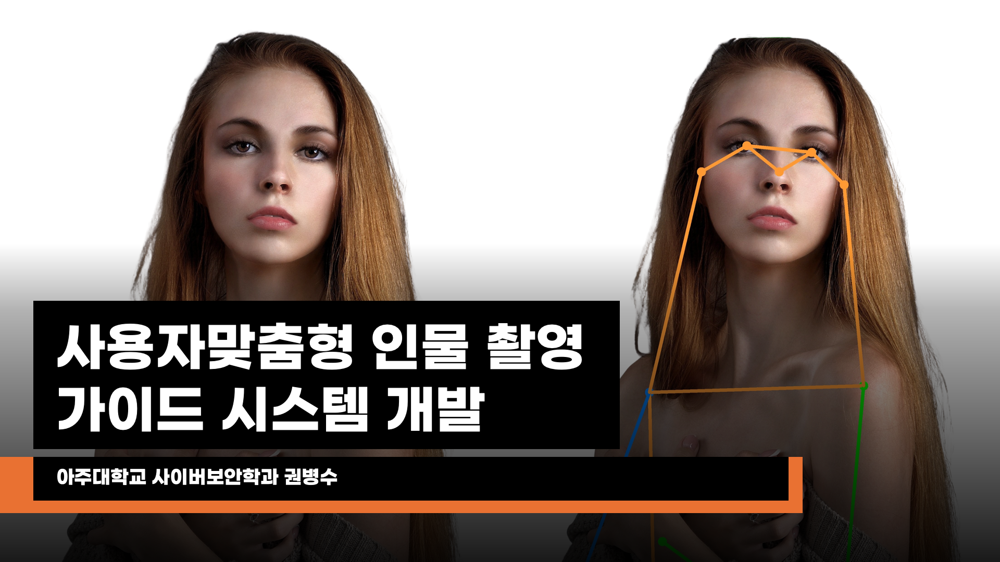
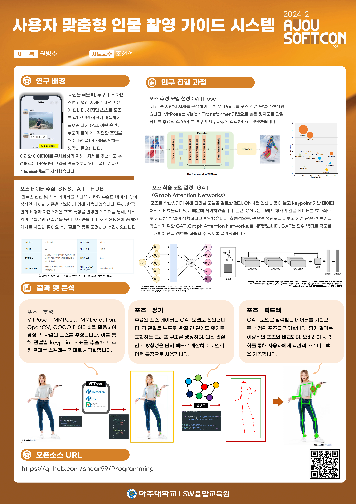
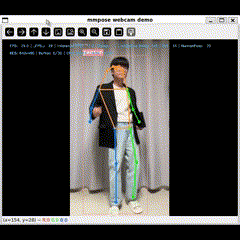
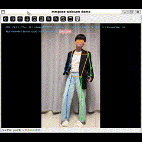
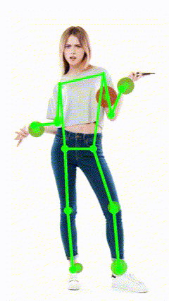

# 사용자 맞춤형 인물 촬영 가이드 시스템 개발
  

**아주대학교 권병수**
dancheong99@gmail.com


## 프로젝트 소개
**"사용자 맞춤형 인물 촬영 가이드 시스템"**은 Human Pose Estimation과 그래프 기반 딥러닝(GAT)을 결합하여 사용자가 사진 촬영 시 더욱 자연스럽고 이상적인 포즈를 취할 수 있도록 가이드를 제공하는 시스템입니다.  
본 프로젝트는 VitPose를 활용한 정밀한 포즈 추정과, **Graph Attention Networks(GAT)**를 이용한 포즈 평가 및 피드백 제공 기능을 중심으로 설계되었습니다.

---

## 주요 기능

### **Human Pose Estimation**
- **VitPose**를 활용하여 사용자의 주요 관절 좌표(Keypoints)를 추출합니다.
- Vision Transformer 기반의 모델로, 고해상도 이미지에서도 정확한 자세 분석 가능.

### **포즈 평가 및 개선**
- **GAT(Graph Attention Networks)**를 활용해 관절별 중요도를 학습하고, 사용자의 현재 포즈와 이상적인 포즈를 비교 평가.
- 인접 관절 간 방향성을 단위 벡터로 표현하여 포즈의 상대적 구조를 정밀하게 학습.

### **실시간 피드백 및 시각화**
- 실시간으로 추정된 포즈와 평가 결과를 시각화하여 직관적으로 개선 방향을 제시.
- 피드백이 필요한 노드를 강조하여 포즈 개선을 쉽게 파악 가능.

---

## 개발 과정

### **포즈 데이터 수집**
- **COCO Dataset**: Human Pose Estimation 모델 학습 및 평가.
- **Reference Pose Data**: 이상적인 포즈 정의를 위해 한국인 전신 및 포즈 데이터 활용.

### **Human Pose Estimation**
- CNN을 사용하지 않고 **Plain Vision Transformer** 기반으로 구현된 **VitPose**를 사용하여 주요 관절 좌표를 추출.

### **포즈 평가 모델 구축**
- **GAT**를 활용해 관절별 관계를 그래프 구조로 모델링.
- 각 관절을 노드로, 관절 간 관계를 엣지로 표현하며, Self-Attention 메커니즘을 통해 중요도를 학습.

### **시각화 및 피드백 제공**
- 평가 결과를 스켈레톤 형태로 시각화하고, 개선이 필요한 부분을 사용자에게 직관적으로 피드백.

---

## 시스템 동작 이미지

 

### **Human Pose Estimation 및 평가 시각화**

  
  


---

## 기대 효과 및 활용

### **스포츠 훈련**
- 이상적인 자세 교정 및 운동 효율성 개선.

### **재활 치료**
- 목표 자세와 현재 자세를 비교하여 효과적인 재활 훈련 지원.

### **일상 촬영 및 사진 가이드**
- 사진 촬영 시 자연스럽고 이상적인 포즈를 실시간으로 제안.

### **연구 및 개발**
- 포즈 추정 알고리즘 평가 및 시각화 도구로 활용.


## 설치 및 실행 방법

### **1. 환경 설정**

본 프로젝트는 Anaconda 환경에서 실행됩니다. 아래 명령어를 통해 새로운 가상 환경을 생성하고 필요한 패키지를 설치합니다

```bash
conda create -n torch python=3.9.20
conda activate torch
pip install -r requirements.txt
```

### **2. Flask 서버 실행 (option)**
웹캠 데이터를 WSL로 스트리밍하기 위해 Flask 서버를 실행합니다. (wsl을 사용하여 웹캠을 직접 사용할 수 없는 경우)
server.py를 다음과 같이 실행하세요

```bash
python server.py
```

이 명령은 Flask 서버를 시작하며, 웹캠 데이터를 HTTP 스트림으로 제공하게 됩니다.

### **3. 실시간 시스템 실행**
server_cam_demo.py를 실행하여 Human Pose Estimation 및 GAT 기반 평가 모델을 실행합니다
```bash
python server_cam_demo.py
```
이 명령은 실시간으로 웹캠 데이터를 수신하고, 포즈 추정 및 평가를 수행하며, 결과를 시각화합니다.
https://github.com/ViTAE-Transformer/ViTPose의 usage 항목을 참고하여 mmcv, ViTPose 등을 설치합니다.

### **4. 실행 중 주요 명령**
실시간 실행 중 사용 가능한 명령은 다음과 같습니다:


```bash
r 키: 현재 포즈 데이터를 캡처하고 평가를 수행.
ESC 키: 실행 종료.
```
